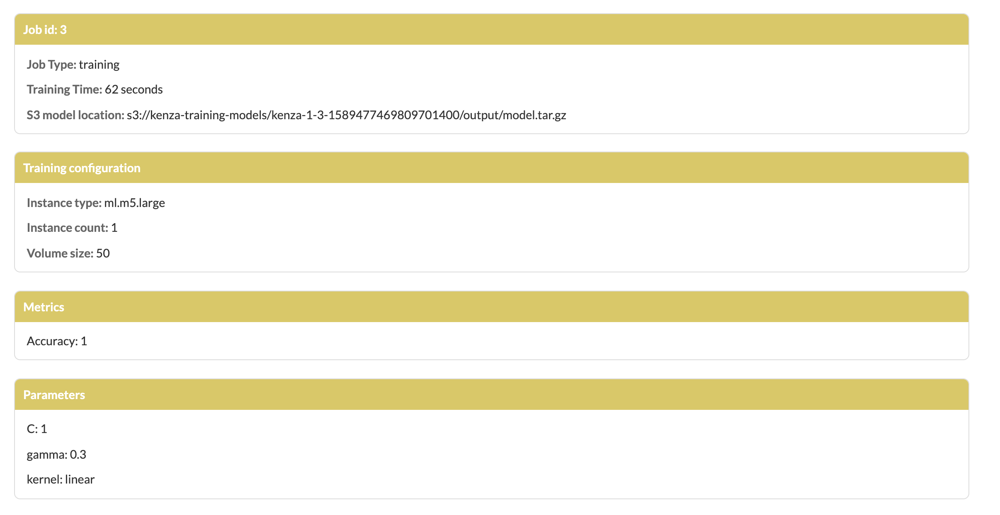

# Kenza

[Kenza](https://github.com/Kenza-AI/kenza) is an open-source Machine Learning Platform.

More specifically, it is an open source cloud-native (moving from `Docker Swarm` to `Kubernetes` in 2020) system for Machine Learning Continuous Integration and Delivery (CD4ML) you can run in one command. It leverages containers and the cloud to provide basic mechanisms for training, tuning and deploying Machine Learning models.

**What ML Engines does it support?**

- AWS SageMaker
- More to be added soon

**What does it provide to Data Scientists?**

- A web UI where you can track and compare your training and hyperparameter tuning jobs, and model deployments

**How does a Data Scientist use it?**

- It's very simple! You need to implement a `train` and `predict` functionality in Python, and define a YAML file. Example:

        sagify:
        
        train:
          input_s3_dir: s3://kenza-ds-demo/iris-data/iris.data
          output_s3_dir: s3://kenza-training-models
          hyperparameters_file: hyperparameters.json
          ec2_type: ml.m5.large
          volume_size: 50
          timeout: 86400
          metrics: Accuracy
          
          deploy:
            instances_count: 1
            ec2_type: ml.t2.medium
            endpoint: some-endpoint

**Why a Machine Learning team should care?**

- Focus on Machine Learning, not ML Ops
- Continuous and Reliable training,  hyperparameter tuning and deployment
- Version control of ML models
- Shorter time to put a model in production
- No need to spend months to change your current ML codebase to meet the needs of this ML platform
- Integrates easily with existing software engineering best practices
- Less resources invested on ML Infrastructure Engineers

**Why a Machine Learning Infrastructure team should care?**

- Clean open-source ML Platform
- Customize it as you wish 
- Shorter time to deliver 
- Easy to integrate with existing Engineering processes
- Support of many ML Engines (at the moment only AWS SageMaker)

**The best part is that you can continue using your favorite libraries!**

## Installation

### Prerequisites

Prerequisites to install kenza

### Install Kenza

Download the binary from the latest GitHub release:

```sh
# Linux
curl -L https://github.com/kenza-ai/kenza/releases/download/v0.0.1-alpha/kenza-linux-amd64 -o kenza
```

```sh
# macOS
curl -L https://github.com/kenza-ai/kenza/releases/download/v0.0.1-alpha/kenza-darwin-amd64 -o kenza
```

Move it under a PATH directory, we prefer `/usr/local/bin`:
```sh
chmod +x kenza
sudo mv ./kenza /usr/local/bin/kenza
```

Ensure you are on the expected version:

```sh
kenza info
```

You should see output similar to the following:

```sh
Kenza info

Version: v0.0.32
Built:   2019-12-09T18:57:05Z
Commit:  099415b5087d919d086b383da73afe1b99bf546f
```

## Getting started for Data Scientists and ML Infrastructure Engineers

Start (or restart) *Kenza* by running:

```sh
kenza start
```

> **Note:** The first run might take longer than subsequent runs due to the *Docker* images downloading for the first time.

> **Important:** The directory from which the `kenza` commands are run from is significant. `kenza start` creates a `kenza` directory in the directory the command was run from. If you run the command again in a different directory, a new `kenza` directory will be created there, essentially a separate `kenza` installation. 

After Kenza has started, navigate to `http://localhost/#/signup` to create an account and get started.

Now, you are ready to train your first ML model:

1. Make sure `awscli` is configured on your local machine and follow instructions [here](https://kenza-ai.github.io/sagify/#usage) to set up an aws profile with access to SageMaker.
2. Docker running locally
3. A local AWS profile with access to AWS SageMaker should be added to your local `awscli` configuration. This [resource](https://kenza-ai.github.io/sagify/#usage) can help you.
4. Create an S3 bucket on your AWS account
5. Fork the `https://github.com/Kenza-AI/kenza-ds-demo` onto your personal Github account
6. Clone the forked repo and `cd kenza-ds-demo`.
7. `make create_environment` to create a virtualenv
8. `workon kenza-ds-demo` to activate the virtualenv
9. `make requirements` to install dependencies
10. `sagify init` to create the required scaffolding for Kenza
11. Type in `kenza-ds-demo` for SageMaker app name, `N` in question `Are you starting a new project?`, `src` for question `Type in the directory where your code lives`, and make sure to choose Python 3 version. Then, choose your preferred AWS profile and region. Finally, type `requirements.txt` in question `Type in the path to requirements.txt`.
12. Replace the `TODOs` in the `train(...)` function in `src/sagify_base/training/training.py` file with:

        input_file_path = os.path.join(input_data_path, 'iris.data')
        clf, accuracy = training_logic(input_file_path=input_file_path, hyperparams_path=hyperparams_path)
        
        output_model_file_path = os.path.join(model_save_path, 'model.pkl')
        joblib.dump(clf, output_model_file_path)
        
        log_metric("Accuracy", accuracy)
                
    and at the top of the file, add:
     
        import os
        
        from sagify.api.hyperparameter_tuning import log_metric
        from sklearn.externals import joblib
        
        from iris_training import train as training_logic

13. Create in the root directory of the project a YAML file with name `.kenza.yml` and the following content:

        sagify:
        
        train:
          input_s3_dir: s3://kenza-ds-demo/iris-data/iris.data
          output_s3_dir: s3://<your-own-bucket>
          hyperparameters_file: hyperparameters.json
          ec2_type: ml.m5.large
          volume_size: 50
          timeout: 86400
          metrics: Accuracy

14. Commit and push changes to master branch
15. Make sure you have created an account on `http://localhost/#/signup` and log in on `http://localhost/`
16. You should see a button prompting you to create your first Kenza project. Click on it.
17. Now it's time to populate the fields:
    1. Go to `https://github.com/settings/tokens` and click on `repo:status`. This will give the ability to Kenza to have read access to this repo. Create the token and copy it.
    
    2. Paste it on the access token field on Kenza
    3. Git ref regex should take the value `refs/heads/master`. This field denotes to which branches or tags to listen to. In this cases, we listen to changes only on master branch.
    4. Repository clone url should be the url of the forked repo under your github account. Example: `https://github.com/pm3310/kenza-ds-demo`
    5. The name of the project can be `Kenza DS Demo`
    6. The description field is optional. Leave it blank for now. 
    7. Click on `Create`! Voilà! Your first Kenza project is created! You should be landed on Kenza's page of projects. 
18. Click on the `run` button on the bottom right corner of the newly created project. This will trigger Kenza to go and find the latest commit on master branch, grab the code and execute training. 
19. Click on the arrow on the created project to see the list of jobs. You'll see something like that: 

20. Click on the id of the training on the top right corner and you'll find the configuration of the training job, input data path, model output path, accuracy metrics and many more!


#### Checking current service status

You can check the status of *Kenza* and its services with:

```sh
kenza status
```

> If the output feels familiar, it's because *Kenza* is deployed as a *Docker stack*. Running `docker stack ps kenza` would generate the same output.

### Scaling up

Kenza runs "one job per worker"; workers are ephemeral in nature and only handle one job before closing down. To run more than one jobs in parallel, simply add more workers:

```sh
kenza scale worker=5
```

> **Note:** Kenza workers do not need nearly as many resources as one may think (due to the nature of ML jobs) because the actual training takes place on the cloud. Kenza workers only clone the repos, prepare the job commands to be run and report on the status of the jobs as they progress through time.

### Cleaning up

You can stop Kenza with:

```sh
kenza stop
```

### Updating Kenza

To update to the latest available version, run:

```sh
kenza update
```

> **Note:** Currently, this only updates the Kenza executable, future work will stop Kenza, apply all necessary changes and restart the system to ensure all services are brought up to their latest versions, migrations are performed etc.

## Running Kenza on the Cloud

### Provisioning resources

*Kenza* leverages [containers](https://docs.docker.com/machine/overview/) to run on the cloud. Before starting *Kenza*, the required resources (manager server(s) / instances, security groups etc) need to be provisioned first.

Ensure your local *AWS* access levels (the profile or role you will be using when running `kenza provision` commands) meet the [*IAM* policy requirements for deploying a *Docker Machine*](https://github.com/docker/machine/issues/1655#issuecomment-409407523).

To provision a machine with the [default values](https://docs.docker.com/v17.12/machine/drivers/aws/#options) on *AWS*, run:

```sh
kenza provision --driver amazonec2 --amazonec2-iam-instance-profile sagemaker-aware-intance-profile kenza-machine-1
```

Any other options you pass will be honored; all options are passed as-is to the corresponding `docker-machine` command. One would pass additional options to use a pre-existing VPC or Security Group to limit access to the instance to a specific office IP range for example. The full list of options available can be found [here](https://docs.docker.com/v17.12/machine/drivers/aws/#options).

You can use any name for the `Docker Machine` (_kenza-machine-1_ in the example above) but the only `driver` supported for now is `"amazonec2"`.

> **Note**: It is highly recommended that the role assigned to the Kenza manager instance follows the [Principle of Least Privilege](https://docs.aws.amazon.com/IAM/latest/UserGuide/best-practices.html#grant-least-privilege) and only provides access to the services and resources that will actually be needed. To identify the exact permissions needed for your use cases use [this AWS reference](https://docs.aws.amazon.com/sagemaker/latest/dg/sagemaker-roles.html)
specific to _SageMaker_. If unsure, *AWS* has been aggressively adding [tools](https://aws.amazon.com/blogs/security/tag/access-advisor/) to make control of roles' more manageable. There are also open-source _Least Privilege Policy_ generators like _Saleforce's_ [Policy Centry](https://github.com/salesforce/policy_sentry/).


Run `docker machine ls` to verify the machine you just created is available.

You can also check the [EC2 Dashboard](https://console.aws.amazon.com/ec2/home) on your *AWS* account for the various resources created (e.g. an instance and a key pair matching the "name" parameter provided earlier to the `provision` command, the "docker-machine" security group and others).

To deploy *Kenza* on the newly created reources, we first need to ensure the `Docker Machine` we just created is [*active*](https://docs.docker.com/machine/reference/active/). To do this, run (substituting if needed `kenza-machine-1` with the name you provided to the `provision` command):

```sh
eval $(kenza env kenza-machine-1)
```

Verify `Docker` is now actually "forwarding all calls" to the remote machine:

```sh
docker-machine active
```

With the machine set up, all *Kenza* commands will now be run against our newly deployed infrastructure, not your local machine.

To start _Kenza_ on EC2, simply run (substituting if needed `kenza-machine-1` with the name you provided to the `provision` command):

```sh
kenza start --name kenza-machine-1 --github-secret webhooks-secret --apikey a-randomly-generated-key
```

After _Kenza_ starts, it will open your default browser to the URL / Public IP of the machine where the _Kenza_ web app can be reached.

Once launched, you can [associate your instance with a static IP or a domain name](https://docs.aws.amazon.com/Route53/latest/DeveloperGuide/routing-to-ec2-instance.html).

## Troubleshooting

### Getting detailed service execution details

You can observe detailed log output for a service with:

```sh
kenza logs service_name
```

You can stop an individual service with:

```sh
kenza stop service_name
```

Valid service names:
- db
- api
- web
- worker
- pubsub
- progress
- scheduler

### Component Overview

Kenza is composed of the following components:

- **API** - Service called by all other services, including the cli, to read / mutate Kenza related data (projects, jobs, schedules etc). 

> Note: API is the only service with direct access / dependency to the Kenza data store. All other services *MUST* go through the API.

- **Web** - *React.js* web application, the *Kenza UI*.

- **Worker** - Worker nodes, the container tasks actually running the jobs. Workers are ephemeral and strictly process one job and one job only before shutting themselves down.

- **Progress** - Listens for job updates published by the worker nodes and propagates them to the *API*.

- **Scheduler** - Listens for job arrivals (on-demand, webhooks and scheduled jobs) and schedules them accordingly to be picked up by workers for processing.

- **PubSub** - *RabbitMQ* exchanges and queues, used for async comms among services.

- **DB** - The *kenza* data store (currently *Postgres*). It can be a *Postgres* container (default option, provided by *Kenza* as a container) or an external resource e.g. an *AWS RDS*, *Heroku* or on-prem installation.

- **CLI** - The *Kenza* command line utility. Think *kubectl, systemctl*.

*Kenza* currently supports *Docker Swarm* environments. Support for *Kubernetes* is being added in 2020.

### Kenza UI

The Kenza web application is a [ReactJS](https://github.com/facebook/react) / [Redux](https://react-redux.js.org) Single Page Application (SPA). You can use the standard tooling e.g. React Tools ([Chrome](https://chrome.google.com/webstore/detail/react-developer-tools/fmkadmapgofadopljbjfkapdkoienihi?hl=en), [Firefox](https://addons.mozilla.org/en-US/firefox/addon/react-devtools/)) to troubleshoot  / report issues with specific browsers.

## Documentation

The following 4 ML pipelines are supported currently:

### Train
In this case, you want just to train your model(s) every time you push to a specific Git branch and report Precision and Recall. An example on how you can specify your `.kenza.yml`:
    
    sagify:
    
    train:
      input_s3_dir: s3://sagify-0.13.1/iris.csv  # Path to training data on S3
      output_s3_dir: s3://kenza-training-models  # Path to where to save trained model(s)
      ec2_type: ml.m5.large                      # EC2 Type for training
      hyperparameters_file: hyperparams.json     # Optional path to local hyperparameters file
      volume_size: 50                            # EBS Volume size
      timeout: 86400                             # Time out (in seconds) until training is forced to stop
      metrics: Precision, Recall                 # Evaluation metrics to report
    
The section "Getting started for Data Scientists" shows how to set up your ML project and report the evaluation metrics in detail.


### Train and Deploy
In this case, you want just to train your model(s) every time you push to a specific Git branch, report Precision and Recall, and (re-)deploy it as a REST Service. An example on how you can specify your `.kenza.yml`:
    
    sagify:
    
    train:
      input_s3_dir: s3://sagify-0.13.1/iris.csv  # Path to training data on S3
      output_s3_dir: s3://kenza-training-models  # Path to where to save trained model(s)
      ec2_type: ml.m5.large                      # EC2 Type for training
      hyperparameters_file: hyperparams.json     # (Optional) Path to local hyperparameters file
      volume_size: 50                            # EBS Volume size
      timeout: 86400                             # Time out (in seconds) until training is forced to stop
      metrics: Precision, Recall                 # (Optional) Evaluation metrics to report
      
      deploy:
        instances_count: 1                       # Number of EC2 instances for inference
        ec2_type: ml.t2.medium                   # EC Type for inference
        endpoint: some-endpoint                  # Name of endpoint

    
The section "Getting started for Data Scientists" shows how to set up your ML project and report the evaluation metrics in detail. In this example you need to implement the deploy functionality. Sagify documentation has an example: https://kenza-ai.github.io/sagify/.


### Tune
In this case, you want just to tune your model(s) every time you push to a specific Git branch and report best hyperparameter values. An example on how you can specify your `.kenza.yml`:
    
    sagify:
    
    hyperparameter_optimization:
      input_s3_dir: s3://sagify-0.13.1/iris.csv        # Path to training data on S3
      output_s3_dir: s3://kenza-training-models        # Path to where to save all trained model(s)
      ec2_type: ml.m5.large                            # EC2 Type for training
      hyperparameter_ranges_file: hyperparams.json     # Path to local hyperparameter ranges file
      volume_size: 50                                  # EBS Volume size
      timeout: 86400                                   # Time out (in seconds) until training is forced to stop
      max_jobs: 2                                      # Number of total max tuning jobs
      max_parallel_jobs: 2                             # Number of max parallel tuning jobs

You also need to specify the hyperparameter ranges file. Here's an example:

    {
        "ParameterRanges": {
            "CategoricalParameterRanges": [
                {
                    "Name": "kernel",
                    "Values": ["linear", "rbf"]
                }
            ],
            "ContinuousParameterRanges": [
            {
              "MinValue": 0.001,
              "MaxValue": 10,
              "Name": "gamma"
            }
            ],
            "IntegerParameterRanges": [
                {
                    "Name": "C",
                    "MinValue": 1,
                    "MaxValue": 10
                }
            ]
        },
        "ObjectiveMetric": {
            "Name": "Precision",
            "Type": "Maximize"
        }
    }


### Tune and Deploy
In this case, you want just to tune your model(s) every time you push to a specific Git branch, report report best hyperparameter values, and (re-)deploy the best model as a REST Service. An example on how you can specify your `.kenza.yml`:
    
    sagify:
    
    hyperparameter_optimization:
      input_s3_dir: s3://sagify-0.13.1/iris.csv        # Path to training data on S3
      output_s3_dir: s3://kenza-training-models        # Path to where to save all trained model(s)
      ec2_type: ml.m5.large                            # EC2 Type for training
      hyperparameter_ranges_file: hyperparams.json     # Path to local hyperparameter ranges file
      volume_size: 50                                  # EBS Volume size
      timeout: 86400                                   # Time out (in seconds) until training is forced to stop
      max_jobs: 2                                      # Number of total max tuning jobs
      max_parallel_jobs: 2                             # Number of max parallel tuning jobs
      
      deploy:
        instances_count: 1                       # Number of EC2 instances for inference
        ec2_type: ml.t2.medium                   # EC Type for inference
        endpoint: some-endpoint                  # Name of endpoint

You also need to specify the hyperparameter ranges file as specified previously.